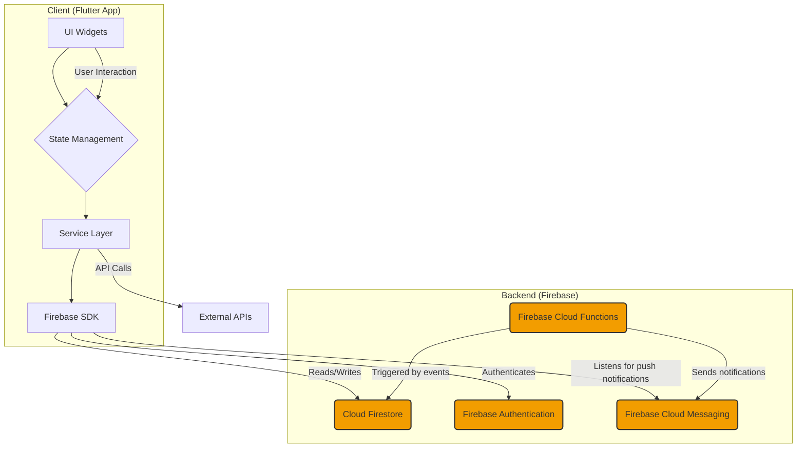

# Muslim Kids Project Documentation

This document provides a complete guide to the "Muslim Kids" application, covering everything from project setup to deployment.

## 1. Project Overview and Setup Guide

### Project Vision

The "Muslim Kids" application is an educational mobile app designed to teach children about Islamic values, practices, and knowledge in an engaging and interactive way. It aims to be a comprehensive digital companion for young Muslims, providing features that cover daily prayers, Islamic education, and community interaction. The primary audience is Muslim children and their parents.

### Key Features

*   **Prayer Times & Alarms:** Provides accurate prayer times based on the user's location and allows setting alarms for each prayer.
*   **Prayer Tracker:** A tool for children to track their daily prayers and build a consistent habit.
*   **Educational Quizzes:** Interactive quizzes on various Islamic topics, including the Quran, Hadith, and Islamic history.
*   **Islamic Videos:** A curated collection of educational and entertaining videos for children.
*   **Islamic Calendar:** Shows important Islamic dates, events, and holidays.
*   **Live Classes:** A feature for teachers to conduct live classes with students.
*   **Progress Tracking:** Parents and children can track learning progress and quiz performance.
*   **User Roles:** Supports different user roles, such as 'child' and 'teacher', with different interfaces and capabilities.

### Tech Stack Summary

| Category      | Technology/Service                                       |
|---------------|----------------------------------------------------------|
| Frontend      | [Flutter](https://flutter.dev/)                          |
| Backend       | [Firebase](https://firebase.google.com/)                 |
| Database      | [Cloud Firestore](https://firebase.google.com/docs/firestore) |
| Authentication| [Firebase Authentication](https://firebase.google.com/docs/auth) |
| Backend Logic | [Firebase Cloud Functions](https://firebase.google.com/docs/functions) |
| Notifications | [Firebase Cloud Messaging](https://firebase.google.com/docs/cloud-messaging) & Local Notifications |
| State Management | `StatefulWidget` with `setState`                         |

### Architecture Overview

The project follows a standard Flutter application architecture with a Firebase backend.

*   **Frontend:** Built with Flutter, allowing for a cross-platform application for iOS, Android, and Web from a single codebase.
*   **Backend:** Powered by Google's Firebase suite.
    *   **Firestore:** Used as the primary NoSQL database for storing user data, quizzes, prayer tracking information, and more.
    *   **Firebase Authentication:** Handles user registration and sign-in.
    *   **Firebase Cloud Functions:** For backend logic that shouldn't run on the client, such as sending notifications.
    *   **Firebase Cloud Storage:** Used for storing assets like user avatars or class materials if needed.

#### Architecture Diagram



### Getting Started

To set up the development environment, you need to have Flutter and the Firebase CLI installed.

#### Prerequisites

1.  **Flutter:** Make sure you have the latest stable version of Flutter installed. You can follow the official [Flutter installation guide](https://docs.flutter.dev/get-started/install).
2.  **Node.js and Firebase CLI:** Required for managing Firebase Cloud Functions.
    *   Install [Node.js](https://nodejs.org/).
    *   Install the Firebase CLI: `npm install -g firebase-tools`
3.  **Code Editor:** An editor like VS Code with the Flutter and Dart extensions is recommended.

#### Setup Instructions

1.  **Clone the Repository:**
    ```bash
    git clone <repository-url>
    cd muslim_kids
    ```

2.  **Install Flutter Dependencies:**
    ```bash
    flutter pub get
    ```

3.  **Set up Firebase:**
    *   This project is already configured with `google-services.json` (for Android) and `Info.plist` (for iOS). To connect to your own Firebase project, you will need to replace these files with the ones from your Firebase project console.
    *   Log in to Firebase: `firebase login`

4.  **Install Cloud Functions Dependencies:**
    ```bash
    cd functions
    npm install
    cd ..
    ```

### Running the App

You can run the app on an emulator, a physical device, or the web.

*   **Run on an emulator/device:**
    ```bash
    flutter run
    ```
*   **Run on the web:**
    ```bash
    flutter run -d chrome
    ```

## 2. Frontend Documentation (`lib/`)

The `lib/` directory contains all the Dart code for the Flutter application.

### Directory Structure

*   `Features/`: Contains the main feature pages of the application. Each file corresponds to a major feature accessible from the home page.
*   `mixins/`: Holds Dart mixins, like `SafeStateMixin` to prevent calling `setState` on unmounted widgets.
*   `models/`: Defines the data structures (e.g., `Quiz`, `PrayerTime`) used throughout the app.
*   `screens/`: Contains screens for specific, non-feature-primary flows, like the quiz session or video player.
*   `services/`: Contains business logic and services that interact with Firebase or provide other core functionalities.
*   `widgets/`: Contains reusable UI components (widgets) shared across multiple screens.
*   `main.dart`: The entry point of the application.
*   `home_page.dart`: The main screen after a user logs in.

### Asset Management (`assets/`)

The `assets/` directory at the root of the project contains all static assets used by the application. This includes:
*   **Images:** Backgrounds, avatars, and feature-specific images (e.g., `prayer_time.jpg`, `quizzes.jpg`).
*   **Lottie Animations:** JSON files for complex animations (e.g., `success.json`, `prayer_alarm.json`).
*   **App Icons:** The source image for generating platform-specific launcher icons (`appicon.jpeg`).

These assets are declared in `pubspec.yaml` to be bundled with the app.

### Key Dependencies (`pubspec.yaml`)

This project relies on several key packages to function:

*   **Firebase:**
    *   `firebase_core`: Required to initialize the Firebase connection.
    *   `cloud_firestore`: For interacting with the Firestore database.
    *   `firebase_auth`: For handling user authentication.
    *   `firebase_messaging`: For receiving push notifications.
*   **UI & Animations:**
    *   `google_fonts`: For using custom fonts from Google Fonts.
    *   `lottie`: For playing high-quality Lottie animations.
    *   `carousel_slider`: For creating image carousels, used on the home page.
*   **Functionality & Services:**
    *   `geolocator`: To get the user's location for accurate prayer times.
    *   `adhan`: A package to calculate Islamic prayer times.
    *   `flutter_local_notifications`: To schedule and display local notifications for prayer alarms.
    *   `youtube_player_flutter`: A video player for playing YouTube videos within the app.
*   **Utilities:**
    *   `shared_preferences`: For storing simple key-value data locally on the device.
    *   `permission_handler`: To request and check platform permissions (e.g., location, notifications).

### Feature Documentation

*   `islamic_calendar_page.dart`: Displays the Islamic calendar, fetching and showing important events.
*   `live_classes_page.dart`: UI for the live classes feature.
*   `prayer_alarm_page.dart`: Allows users to view prayer times and set alarms.
*   `prayer_tracker_page.dart`: Provides a calendar-based interface for tracking daily prayers.
*   `quizzes_page.dart`: The main page for the quiz feature, listing available quiz categories.
*   `videos_page.dart`: Displays a list of educational videos for kids.

### Widget Library (`widgets/`)

*   `islamic_header.dart`: A reusable header widget with an Islamic-themed design, used across various pages to provide a consistent look and feel.
*   `loading_skeleton.dart`: A loading animation widget used to improve user experience while data is being fetched.

### Models (`models/`)

*   `islamic_event.dart`: Defines the `IslamicEvent` class for calendar events.
*   `islamic_video.dart`: Defines the `IslamicVideo` class for video content.
*   `prayer_time.dart`: Defines the `PrayerTime` class for storing prayer time information.
*   `quiz_model.dart`: Defines the data structures for quizzes, including `Quiz`, `Question`, and `Answer`.

## 3. Backend Documentation

The backend is built entirely on Firebase.

### Firebase Services (`functions/`)

The `functions/` directory contains Node.js code for Firebase Cloud Functions.

*   `index.js`:
    *   **`sendNotificationOnNewVideo`**: A function that would be triggered when a new video is added to the Firestore `videos` collection, sending a notification to all users.
    *   **`updateUserRole`**: An example of a callable function to manage user roles.

### Firestore Database

The Firestore database is structured into several collections:

*   **`users`**: Stores user profile information, including `uid`, `email`, `name`, `role` ('child' or 'teacher'), and prayer tracking data.
    *   **Example Document (`/users/{userId}`):**
        ```json
        {
          "name": "Aisha",
          "email": "aisha@example.com",
          "role": "child",
          "prayer_tracker": {
            "2024-05-20": ["Fajr", "Dhuhr", "Asr"],
            "2024-05-21": ["Fajr", "Dhuhr", "Asr", "Maghrib", "Isha"]
          }
        }
        ```
*   **`quizzes`**: Contains all the quiz documents. Each document represents a quiz category and holds a collection of questions.
    *   **Example Document (`/quizzes/quran_stories`):**
        ```json
        {
          "title": "Stories of the Prophets",
          "description": "A quiz about the prophets mentioned in the Quran.",
          "questions": [
            {
              "questionText": "Which prophet built the Ark?",
              "options": ["Musa (AS)", "Nuh (AS)", "Ibrahim (AS)"],
              "correctAnswerIndex": 1
            }
          ]
        }
        ```
*   **`videos`**: Stores metadata about the videos, like `title`, `description`, and `url`.
*   **`islamic_calendar`**: Contains documents for each Islamic month, with events stored as a map or sub-collection.

#### Firestore Rules (`firestore.rules`)

The security rules in `firestore.rules` define access control for the database.
*   User data in the `users` collection is only readable and writable by the authenticated user themselves.
    ```
    match /users/{userId} {
      allow read, write: if request.auth.uid == userId;
    }
    ```
*   Content collections like `quizzes` and `videos` are generally readable by all authenticated users but only writable by administrators (a role not yet fully implemented).
    ```
    match /quizzes/{quizId} {
      allow read: if request.auth != null;
      // allow write: if get(/databases/$(database)/documents/users/$(request.auth.uid)).data.role == 'admin';
    }
    ```

### Authentication

Firebase Authentication is used to manage user accounts. The app currently supports email/password-based registration and login. The login and registration flows are handled in `login_page.dart` and `register_page.dart`.

## 4. Core Logic and Services

This section details the core services that power the application's features.

### Service Layer (`services/`)

*   `prayer_alarm_service.dart`: Fetches prayer times from an external API and manages scheduling local notifications for prayer alarms.
*   `quiz_service.dart`: Handles all logic related to quizzes, including fetching quiz data from Firestore and saving user scores.
*   `video_service.dart`: Fetches video data from the `videos` collection in Firestore.
*   `user_data_service.dart`: Manages reading and writing user-specific data from/to the `users` collection in Firestore.
*   `islamic_calendar_service.dart`: Fetches Islamic calendar events from Firestore.

### Notifications

The app uses two types of notifications:

1.  **Local Notifications (`local_notification_service.dart`)**: Handled by the `flutter_local_notifications` package. These are used for features like prayer alarms, which are scheduled on the device itself.
2.  **Push Notifications (`firebase_notification_service.dart`)**: Handled by Firebase Cloud Messaging (FCM). These are used to send notifications from the backend, such as an alert for a new video or a live class starting.

### State Management

The application primarily uses `StatefulWidget` and the `setState` method for managing local state within individual widgets. For more complex state management needs or global state, a more advanced solution like Provider or Riverpod could be integrated in the future. The `SafeStateMixin` is used to ensure `setState` is not called after a widget has been disposed, which is a common source of errors.

## 5. Contribution and Deployment Guide

### Testing

A basic testing setup is included in the project.

*   **Running Tests:** You can run tests from the command line:
    ```bash
    flutter test
    ```
*   **Current State:** The project has a default widget test in `test/widget_test.dart`.
*   **Testing Strategy:**
    *   **Unit Tests:** Should be written for services and models to verify business logic without needing the Flutter UI.
    *   **Widget Tests:** For testing individual widgets to ensure they render correctly and respond to user interaction.
    *   **Integration Tests:** To test complete user flows, from login to completing a quiz. These are crucial for ensuring features work end-to-end. A good future goal is to expand test coverage in all these areas.

### Contribution Guide (`CONTRIBUTING.md`)

To contribute to the "Muslim Kids" project, please follow these guidelines:

*   **Branching:**
    *   Create a new branch for each new feature or bug fix.
    *   Use a descriptive branch name, e.g., `feature/add-new-quiz-type` or `fix/login-page-bug`.
*   **Code Style:**
    *   Follow the official [Dart style guide](https://dart.dev/guides/language/effective-dart/style).
    *   Run `flutter format .` before committing your changes.
*   **Pull Requests (PRs):**
    *   Submit a PR to the `main` branch.
    *   Provide a clear description of the changes in your PR.
    *   Make sure your code builds and runs without errors.

### Deployment Guide (`DEPLOYMENT.md`)

#### Deploying Firebase Functions

Any changes to the cloud functions in the `functions/` directory must be deployed.

```bash
cd functions
firebase deploy --only functions
```

#### Building and Releasing the Flutter App

**Android:**

1.  **Build the App Bundle:**
    ```bash
    flutter build appbundle
    ```
2.  **Upload to Google Play:**
    *   The generated app bundle will be at `build/app/outputs/bundle/release/app-release.aab`.
    *   Upload this file to the Google Play Console.

**iOS:**

1.  **Build the Archive:**
    ```bash
    flutter build ipa
    ```
2.  **Upload to App Store Connect:**
    *   Open the generated `.xcarchive` file in Xcode (located in `build/ios/archive/`).
    *   Use Xcode to validate and distribute the app to App Store Connect. 